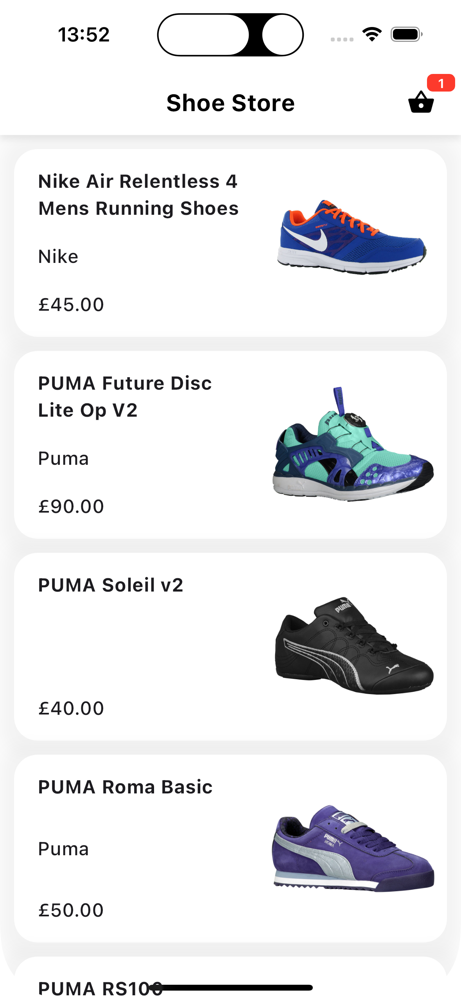
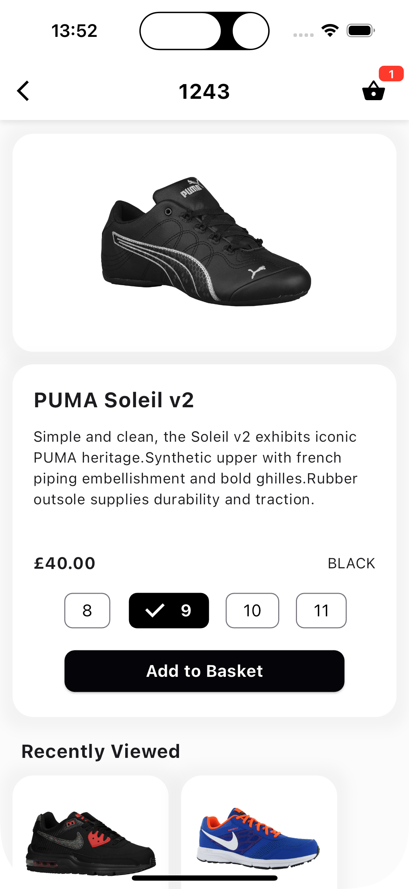
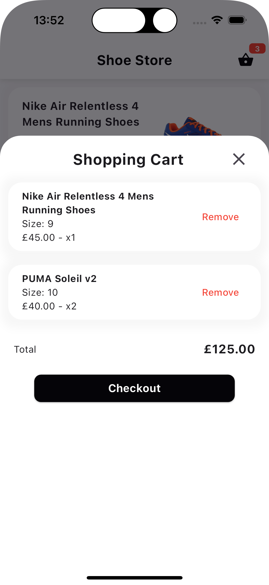

# One Iota Shoe Store Application Task
Mark Gawlyk - 14-07-2024

## Design & Implementation

- Model defining the products pulled from the endpoint, including to and from JSON helper functions. Additional model defined for the 'Price' field.

- Model created for cart items, when a product is added to the cart. Using the SKU of product and the size selected to define the cart item.

- Providers created for the products and the cart items, calling upon the API and SharedPreferences respectively.

- Page consuming the product provider to display all products, displaying a small thumbnail image, the name and a few other details.

- Product page to display all details about a product and allow the user to add it to the cart. Also displaying recently viewed items, excluding product being currently viewed.

- Cart page / pop up displaying the users shopping cart, displaying quantities and prices, and summing the total. User can remove items from the cart.

## UI

## Further Improvements

*Areas with scope for further improvement:*

- Filter products by colour, size, stock status, price...

- Shopping Cart page does not account for multiple currencies being used when calculating the total. 'Multiple' is displayed before the figure, but should be separated by currencies (not all added together).

- Recently viewed does not have a limit - due to the limited number of products, this is fine, but if the number of products were to increase, this could be an issue.

- Similarly, the products page does not have a limit on the number of products displayed. Paging could be implemented to improve performance.

- Broken or empty images are handled, but do not result in a nice UI - handling this case with custom 'image-less' widgets would be a nice touch.